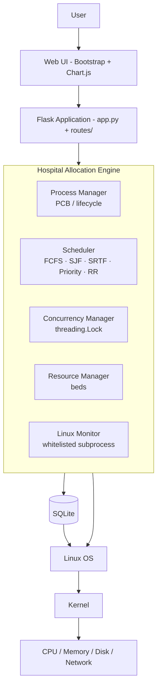
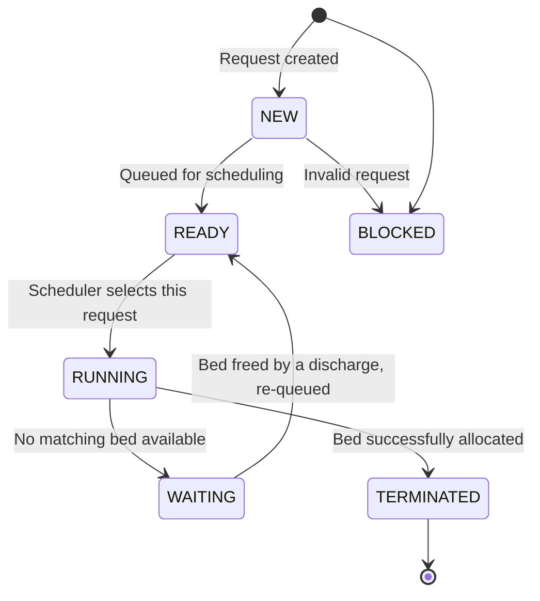
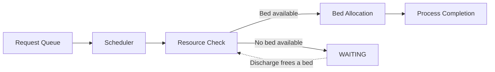
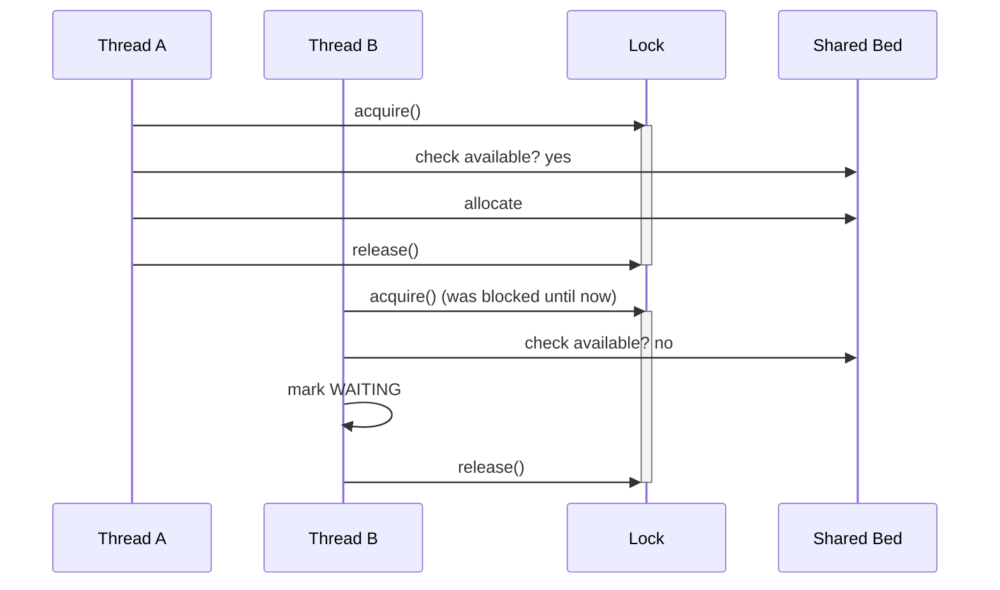

# Project Architecture

## Layered view

This is the picture referenced throughout the code comments. Two things
are true at once, and the project is careful never to blur them:

- **A (application-level simulation):** the scheduler, PCB and process
  lifecycle are built entirely in Python/Flask, to *teach and demonstrate*
  OS concepts.
- **B (real OS behaviour):** the Linux Monitor, the shell scripts, and the
  actual thread/process creation via Python's `threading`/`multiprocessing`
  modules genuinely execute on top of the real Linux kernel — nothing
  there is mocked.

## Request lifecycle through the layers

1. A patient's allocation request is submitted through the Web UI
   (`templates/requests.html` → `routes/request_routes.py`).
2. It is stored as a row in `allocation_requests` (a "job") via
   `models/requests.py`.
3. When an admin runs the Scheduler, `services/scheduler.py` builds one
   PCB per request (`services/process_manager.py` + `models/processes.py`)
   and calls the chosen algorithm in `schedulers/`.
4. `services/allocation_service.py` walks the algorithm's finishing order
   and, for each request, performs the real resource check — this is the
   guarded critical section (see `docs/CONCURRENCY.md`).
5. Every allocation or wait is written to `allocation_history` for audit
   (`models/history.py`), and the PCB is advanced to `TERMINATED` or
   `WAITING`.
6. Flask, in turn, only reaches SQLite and the filesystem through Python's
   standard library, which itself asks the OS to do the work — see
   `docs/OS_CONCEPT_MAPPING.md` for the exact system-call-level examples.

## Process lifecycle diagram

## Bed allocation workflow

## Thread synchronization

## CPU scheduling (example: Priority)

```mermaid
gantt
    dateFormat X
    axisFormat %s
    section Requests
    P1 (Critical) :done, p1, 0, 5
    P5 (Critical) :done, p5, 5, 10
    P3 (High)     :done, p3, 10, 16
    P4 (Medium)   :done, p4, 16, 22
    P2 (Low)      :done, p2, 22, 28
```

## Why Flask + SQLite + vanilla JS

The brief explicitly asks for a stack that demonstrates OS concepts
clearly, not one that demonstrates enterprise architecture skills. React,
Docker, Kubernetes, Redis and microservices would add real infrastructure
concepts to learn (containers, orchestration, caching) that are outside
this course's syllabus and would dilute the OS focus. Flask + SQLite +
Bootstrap/Chart.js keeps every extra concept in the room related to
Operating Systems.
